# Riyaaz

A content-based music recommendation system, that suggests playlists made from the locally stored songs, and updates its suggestions based on the user feedback using non-stationary Bayesian reinforcement learning. 

Created using the *React* and the *Electron.js* frameworks. This project was bootstrapped with [Create React App](https://github.com/facebook/create-react-app).
___

## Project Demo

<a href="https://www.youtube.com/watch?v=sQdatvIpiKE" title="Riyaaz Demo" target="_blank">
    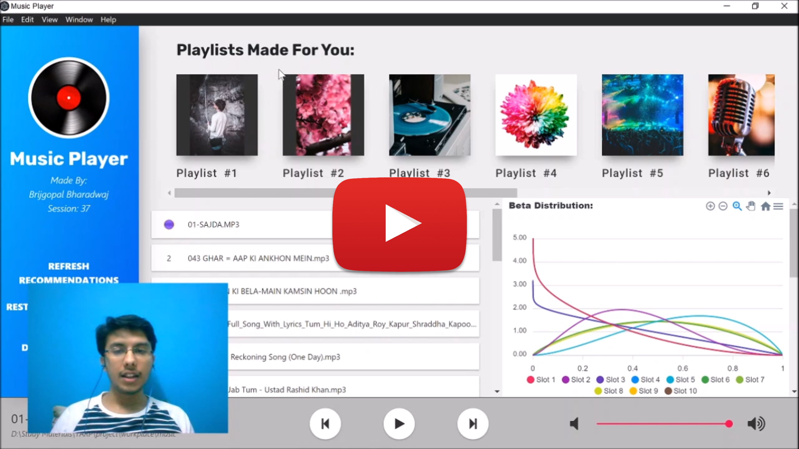
</a>

___

## Required Environment Variables

VARIABLE | Sample value
--- | ---
BROWSER | none
___

## Available Scripts

In the project directory, you can run:

### `npm start`

Runs the app in the development mode. 
It opens a protable Electron window, in the development mode, i.e. the page will reload if you make edits. Also, you will also see any lint errors in the console.

## Extracted Feature-Set from Local Songs

    
Song Waveform

    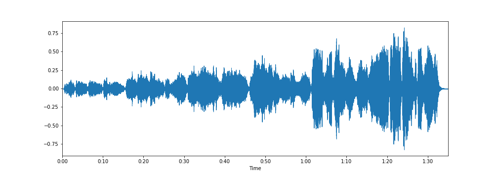

___

    
Tonnetz feature values

    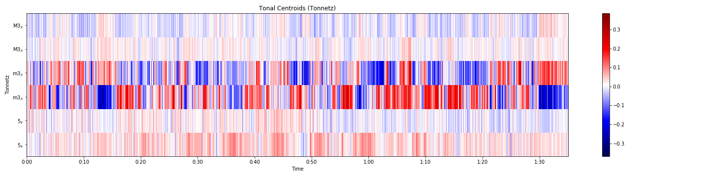

___

    
Mel-frequency values

    

___

    
Chromagram

    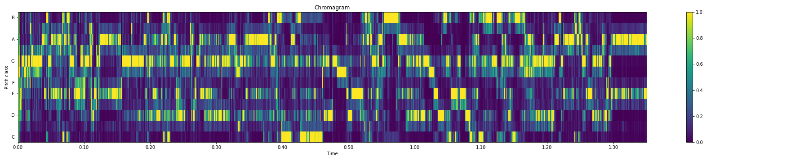

___

    
MFCC values

    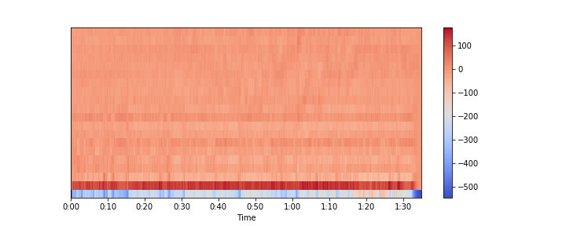

___

    
RMS values

    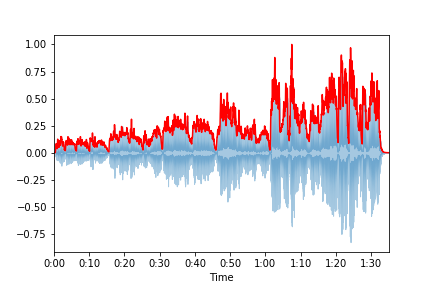

___

    
Zero-Crossing Rate Values

    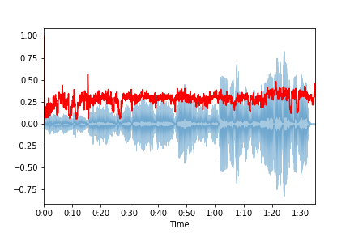

___

    
Spectral-Centroid values

    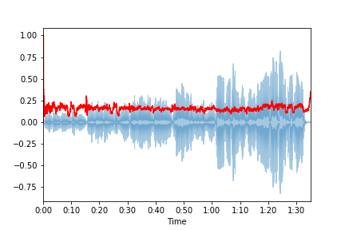

___

    
Spectral-Rolloff values

    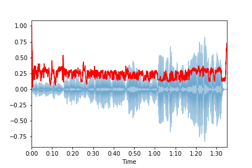

___

    
Spectral-Bandwidth values

    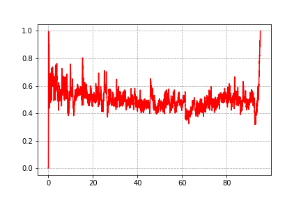

___

    
Spectral-contrast values

    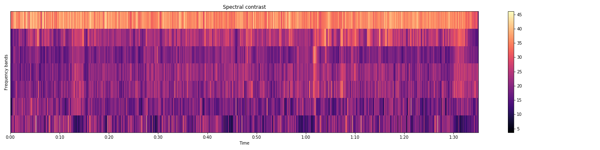

